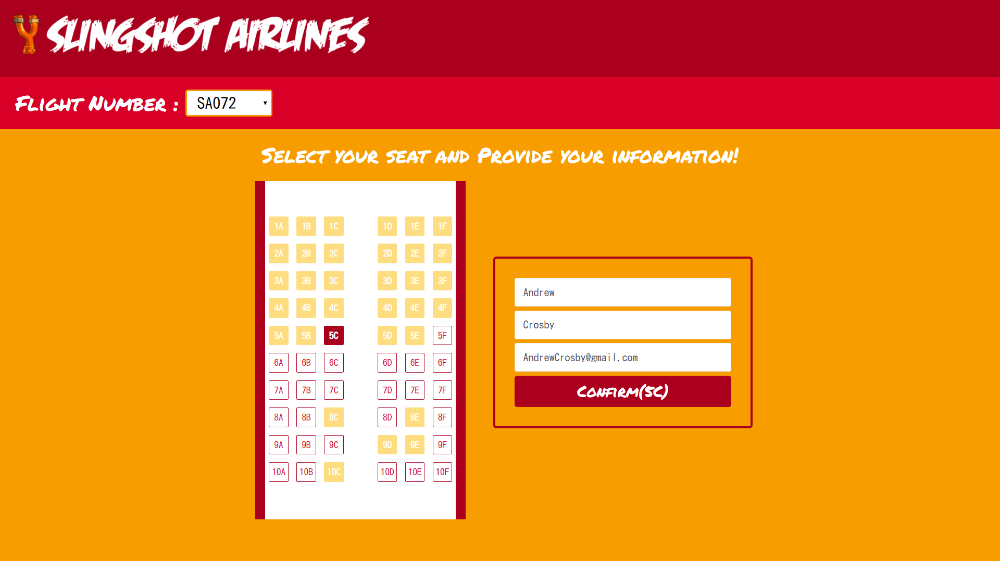
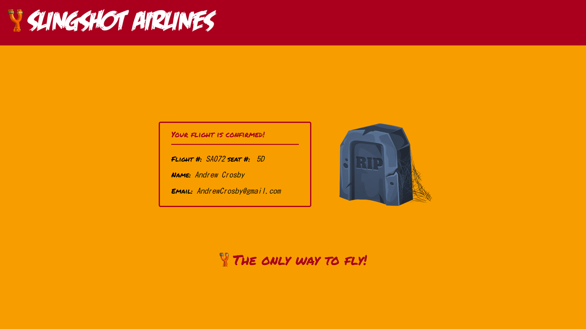

# SlingAir

This is an application where a user can book a seat inside a plane and receive a confirmation ticket.

## TECH STACK

- HTML / CSS / Javascript
- NodeJS and express

## RUN LOCALLY
```
$ git clone https://github.com/Charles9869/Slingair.git
$ yarn dev
```
## SCREENSHOTS

### Main page



### Confirmation page


